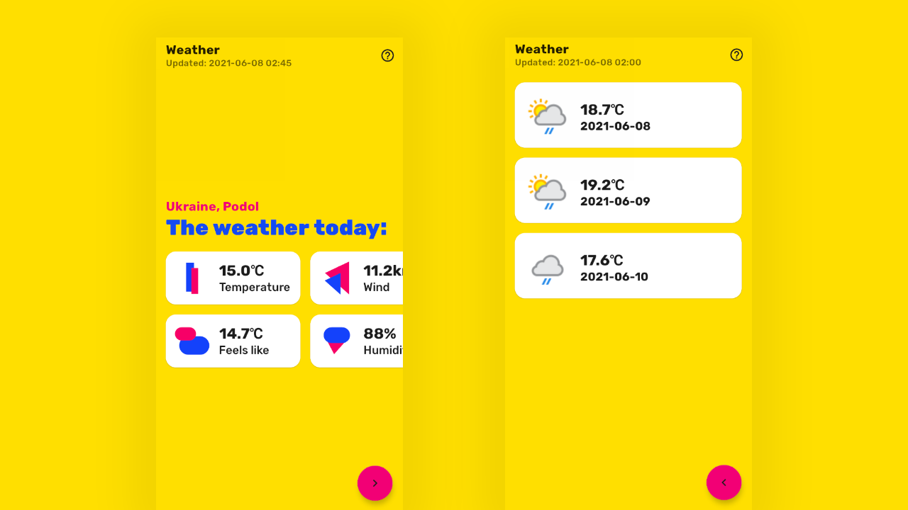

# Weather app

[](#)
[](#)



> 😖 This application was created for training purposes and may use an incorrect implementation.

## ⚛️ Information

A simple app for viewing the weather. Download the apk file by following [this link](https://github.com/nexy791/weather/releases)

## 📖 Stack/Libraries 

### 1. Stack

* Kotlin 
* Material Design, inspired by the Owl app
* MVVM
* Android Architecture Components 
* Navigation component
* Lifecycle
* Retrofit2
* Room
* Coroutines
* Jetpack

### 2. Libraries

* [ViewBindingPropertyDelegate](https://github.com/kirich1409/ViewBindingPropertyDelegate)
* [Moshi](https://github.com/square/moshi)
* [Coil](https://github.com/coil-kt/coil)

## 🌐 API

The application uses the [WeatherApi](https://www.weatherapi.com/) API to retrieve weather information. Please do not abuse the access token.

## ©️ Author.

* GitHub: [@nexy791](https://github.com/nexy791)
* License: Apache-2.0 License

```

Copyright 2021 Aleander Nexy

Licensed under the Apache License, Version 2.0 (the "License");
you may not use this file except in compliance with the License.
You may obtain a copy of the License at

http://www.apache.org/licenses/LICENSE-2.0

Unless required by applicable law or agreed to in writing, software
distributed under the License is distributed on an "AS IS" BASIS,
WITHOUT WARRANTIES OR CONDITIONS OF ANY KIND, either express or implied.
See the License for the specific language governing permissions and
limitations under the License.

```
